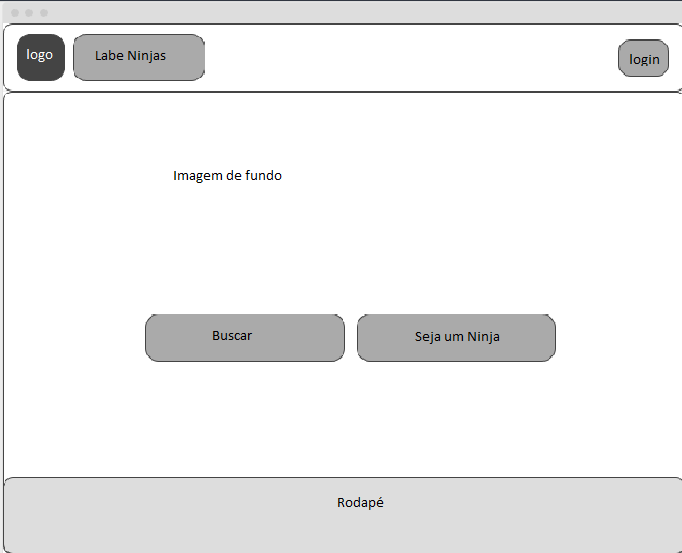
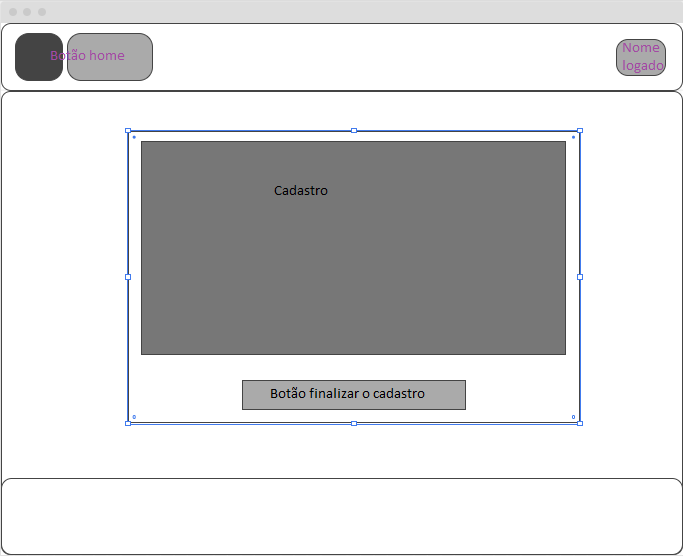
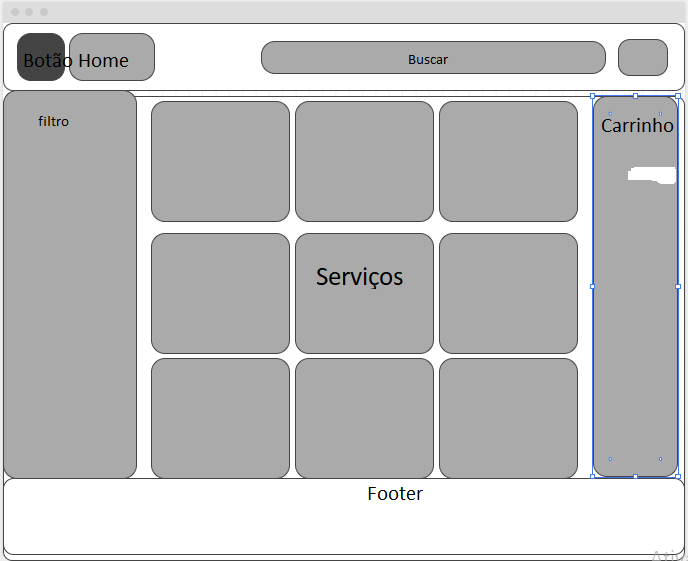
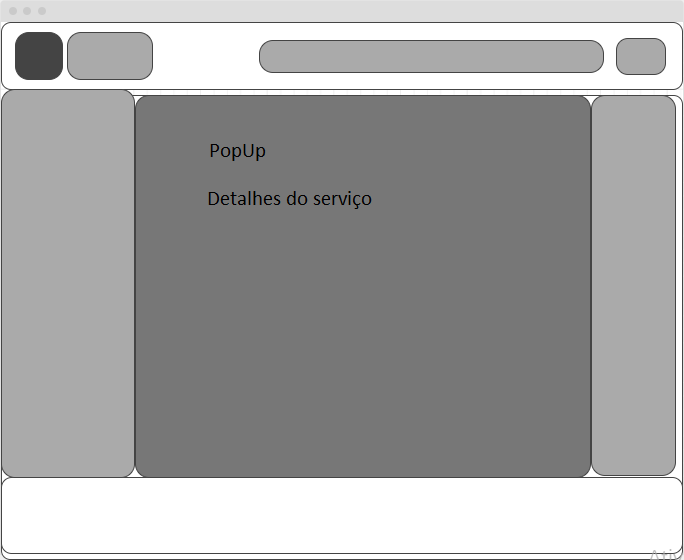
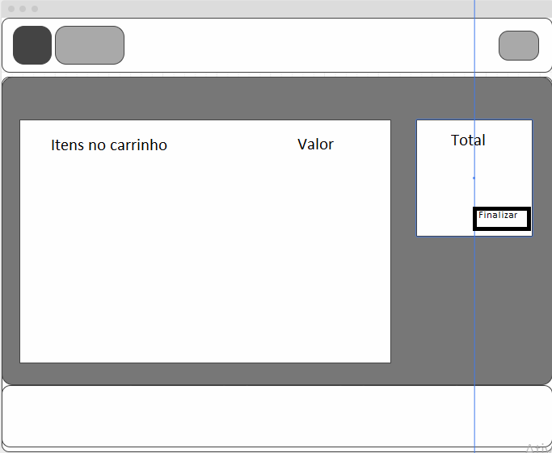

# Projeto Labeninjas

## Dia 2 - Planejamento

Hoje terminamos de definir o planejamento do projeto e fizemos o wireframe.
Fizemos de maneiro bem simples apenas para exemplificar a ideia da pagina que iremos fazer.

Segue abaixo as imagens:

## Palheta de cores

Seguiremos a palheta de cores do logo fornecido

/* CSV /
7d66c1,f3f3fb,505050,b2a9d4,9e8fd3,cfcbe2,c4bbe1,9c9a9c,c4c4c4

/ Array */
["7d66c1","f3f3fb","505050","b2a9d4","9e8fd3","cfcbe2","c4bbe1","9c9a9c","c4c4c4"]

